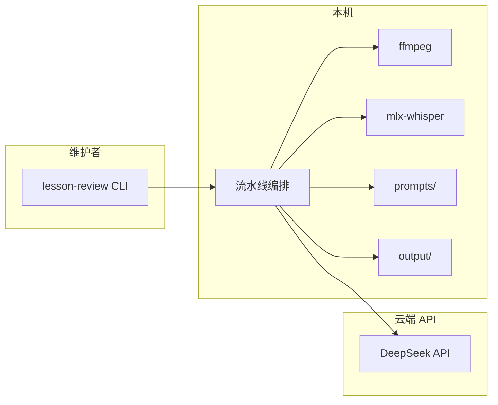
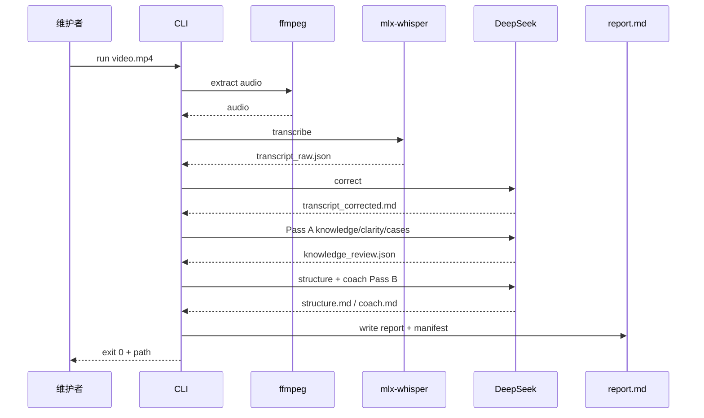

# 系统概览

- **版本**：v0.2
- **日期**：2026-07-25
- **关联 ADR**：`docs/02-architecture/adr/`（含 ADR-0004 两段式专业预审，Proposed）

---

## 1. 上下文（C4 精简）

本系统是**本地 CLI 编排的课评流水线**：消费授课音视频，产出私密 Markdown 报告。业务标准来自上游文档仓；本仓负责执行与提示词版本。



---

## 2. 逻辑组件

| 组件           | 职责                                              | 技术                        |
| -------------- | ------------------------------------------------- | --------------------------- |
| CLI            | 解析参数、退出码、调用编排                        | Python（Typer 或 argparse） |
| Media          | 视频抽轨、格式探测                                | ffmpeg                      |
| ASR            | 语音转文字、时间戳                                | mlx-whisper                 |
| LLM Client     | 纠错、**Pass A 专业预审**、结构、建议；重试与限流 | OpenAI 兼容 SDK → DeepSeek  |
| Prompt Store   | 系统语气、分步任务模板（含 knowledge 预审）       | `prompts/*.md` + 版本记录   |
| Report Builder | 合并 Pass A JSON 与后续 Markdown 为 `report.md`   | Python 拼接（MVP）          |
| Manifest       | 运行元数据、可复现                                | `manifest.json`             |

---

## 3. 数据流（单视频）



模块模式：对每个视频重复 ASR（可并行化，M2 优化），再增加一次 **module 级 LLM 调用**（`structure_module` + 跨视频建议）。单视频专业预审见 ADR-0004。

---

## 4. 计划仓库布局（实现 Issue 落地）

```text
lesson-review-ai/
  src/lesson_review/       # 包代码
  prompts/                 # 版本化提示词
  tests/                   # 单元 + 契约测试（脱敏 fixture）
  docs/                    # 本文档树
  output/                  # gitignore
  data/input/              # gitignore，维护者放样例
  pyproject.toml
  .env.example
```

---

## 5. 边界与信任

| 数据         | 停留位置                                 |
| ------------ | ---------------------------------------- |
| 原始音视频   | 本机 `data/input` 或任意路径，不入库     |
| 转写全文     | 本机 `output/<run_id>/`                  |
| API 请求正文 | 经 HTTPS 发往 DeepSeek；遵守组织数据合规 |
| 报告         | 默认仅本机；分享责任在维护者             |

---

## 6. 演进预留（非 MVP）

- Web UI、任务队列、对象存储
- 云端 ASR 回退（密钥轮换、无 GPU 环境）
- 提示词 A/B 与自动评测集
- 简易 CI：lint + 契约测试 + `--dry-run`

---

## 7. 修订记录

| 版本 | 日期       | 说明                                   |
| ---- | ---------- | -------------------------------------- |
| v0.1 | 2026-07-23 | 首版概览                               |
| v0.2 | 2026-07-25 | 数据流改为 Pass A / Pass B；组件表同步 |
| v0.3 | 2026-07-25 | 数据流标注含 clarity（报告契约 v0.3）  |
