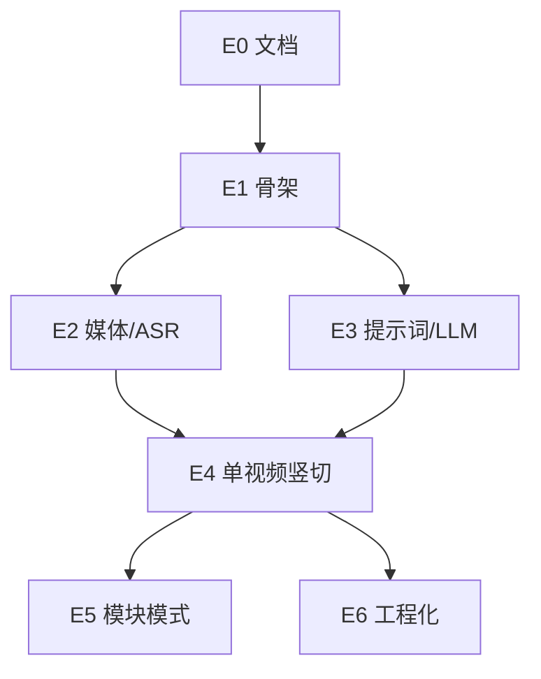

# 竖切交付与 Issue 地图

- **版本**：v0.1
- **日期**：2026-07-23
- **原则**：**Tracer bullet**——优先打通一条贯穿各层的竖切，再补模块模式与工程化（与常见 AI 工程工作坊中的竖切拆 Issue 做法一致）。

---

## 1. 里程碑

| 里程碑  | 目标                         | 建议 Issue 范围                   |
| ------- | ---------------------------- | --------------------------------- |
| **M0**  | 文档冻结 + Markdown 工具链   | 已合入 `main`（Issue #1 / PR #2） |
| **M0b** | 开发环境（uv / Python 3.12） | Issue #3                          |
| **M1**  | 竖切可演示                   | E1～E4（单视频端到端）            |
| **M2**  | MVP 完整（含模块模式）       | E5                                |
| **M3**  | 可维护                       | E6（按需）                        |

**开发启动门禁**：维护者提供脱敏样例媒体 + DeepSeek API Key 已写入本地 `.env`。

---

## 2. Epic 与 Issue 清单

以下编号可直接用作 GitHub Issue 标题前缀；依赖关系见第 3 节。

### E0 · 文档与协作基线

| ID   | 标题                            | 验收标准                                                                       |
| ---- | ------------------------------- | ------------------------------------------------------------------------------ |
| E0-1 | `docs: 产品/架构/交付文档 v0.1` | `docs/01-product`、`02-architecture`、`03-delivery` 齐全；`docs/README` 已更新 |
| E0-2 | `chore: PR 模板与 Issue 模板`   | `.github/PULL_REQUEST_TEMPLATE.md` 含验收勾选、是否改 prompts                  |

### E1 · 仓库骨架

| ID   | 标题                                            | 验收标准                                                                    |
| ---- | ----------------------------------------------- | --------------------------------------------------------------------------- |
| E1-1 | `feat(cli): Python 包骨架与 lesson-review 入口` | `pyproject.toml`；`lesson-review --help`；Python ≥3.11                      |
| E1-2 | `feat(cli): 依赖与环境检查`                     | `--dry-run` 检测 ffmpeg、mlx-whisper 导入、LLM Key 是否存在；退出码符合契约 |

### E2 · 媒体与 ASR

| ID   | 标题                          | 验收标准                                   |
| ---- | ----------------------------- | ------------------------------------------ |
| E2-1 | `feat(media): ffmpeg 抽轨`    | 给定 mp4 输出 m4a/wav；错误码 1/2 符合契约 |
| E2-2 | `feat(asr): mlx-whisper 转写` | 输出 `transcript_raw.json`（含片段时间戳） |

### E3 · 提示词与 LLM

| ID   | 标题                               | 验收标准                                                                               |
| ---- | ---------------------------------- | -------------------------------------------------------------------------------------- |
| E3-1 | `feat(prompts): 五类提示词骨架`    | `system_tone`、`asr_correct`、`structure_single`、`structure_module`、`coach_feedback` |
| E3-2 | `feat(llm): DeepSeek 客户端与重试` | 读 `.env`；超时与 429 有限重试；日志不泄露 Key                                         |

### E4 · 单视频竖切（M1 核心）

| ID   | 标题                                  | 验收标准                                             |
| ---- | ------------------------------------- | ---------------------------------------------------- |
| E4-1 | `feat(pipeline): 单视频 run 编排`     | `lesson-review run <file>` 端到端；写 manifest       |
| E4-2 | `feat(report): 单视频 report.md 渲染` | 符合 `003_report-contract`；维护者在样例上认可可读性 |

### E5 · 模块模式（M2）

| ID   | 标题                                    | 验收标准                                                     |
| ---- | --------------------------------------- | ------------------------------------------------------------ |
| E5-1 | `feat(pipeline): module 模式排序与警告` | 3～5 文件；前缀数字排序；缺号警告                            |
| E5-2 | `feat(report): 模块双层报告`            | 含模块层 + 各视频层；嵌套缺口非空（样例上至少 1 条合理提示） |

### E6 · 工程化（M3，按需）

| ID   | 标题                           | 验收标准                            |
| ---- | ------------------------------ | ----------------------------------- |
| E6-1 | `test: 契约测试与脱敏 fixture` | 无真实课例；mock LLM 或录制固定响应 |
| E6-2 | `ci: ruff + pytest on PR`      | main 保护；失败不可合入             |
| E6-3 | `docs: README 运维与故障排除`  | ffmpeg、模型下载、常见错误码        |

---

## 3. 依赖关系（建议实施顺序）

**M1 最小路径**：E1 → E2 + E3（可并行）→ E4。

---

## 4. Issue 写法规范（企业常见实践）

每个 GitHub Issue 建议包含：

1. **背景**：链到 PRD 章节或 ADR。
2. **范围**：本 Issue 做 / 不做（防止 scope creep）。
3. **验收标准**：可勾选列表（QA 即维护者试用）。
4. **依赖**：Blocked by #n。
5. **类型标签**：`feat` / `docs` / `chore` / `test`。
6. **竖切标注**：是否属于 M1 演示路径。

PR 描述应链接 Issue，并附「样例运行命令 + 报告截图或路径说明」（无真实学员信息）。

---

## 5. 与 MVP 验收的对照

| MVP 验收项（PRD §4） | 覆盖 Issue                   |
| -------------------- | ---------------------------- |
| 单视频端到端         | E4                           |
| 模块 3～5 视频       | E5                           |
| 总分总 / 嵌套缺口    | E4、E5 + prompts             |
| 可执行建议           | E3、E4                       |
| 维护者愿意用         | 样例课例 + E4 完成后主观确认 |

---

## 6. 修订记录

| 版本 | 日期       | 说明                                      |
| ---- | ---------- | ----------------------------------------- |
| v0.1 | 2026-07-23 | 首版地图                                  |
| v0.2 | 2026-07-24 | 标明 M0 已合入；增加 M0b；修正 M1/M2 范围 |
