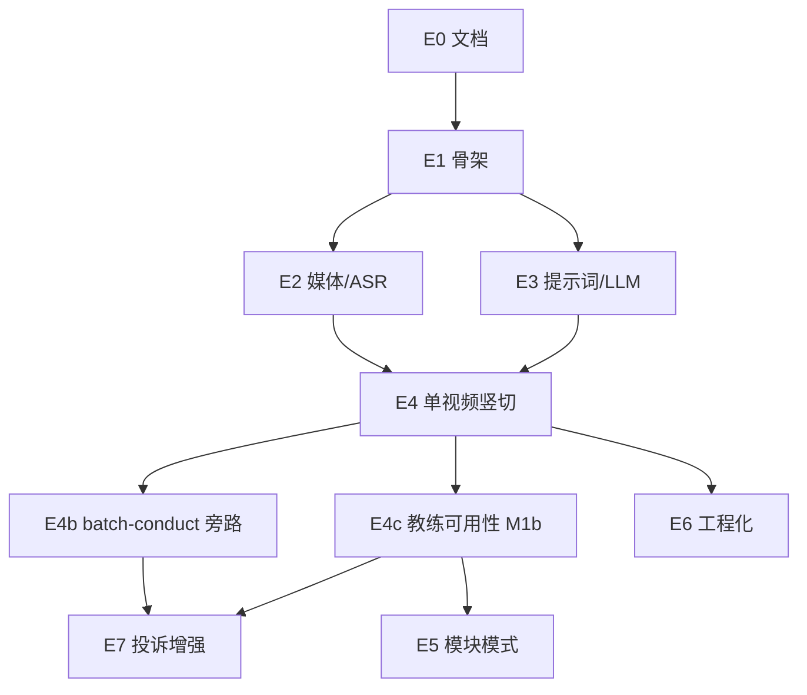

# 竖切交付与 Issue 地图

- **版本**：v0.4.2
- **日期**：2026-08-07
- **原则**：**Tracer bullet**——优先打通一条贯穿各层的竖切，再补模块模式与工程化（与常见 AI 工程工作坊中的竖切拆 Issue 做法一致）。

---

## 1. 里程碑

| 里程碑    | 目标                                        | 建议 Issue 范围                                      |
| --------- | ------------------------------------------- | ---------------------------------------------------- |
| **M0**    | 文档冻结 + Markdown 工具链                  | 已合入 `main`（Issue #1 / PR #2）                    |
| **M0b**   | 开发环境（uv / Python 3.12）                | Issue #3                                             |
| **M1**    | 竖切可演示                                  | E1～E4（单视频端到端）                               |
| **M1b\*** | 单视频教练可用：课程设计口径 + 先验分校带教 | **E4c（下一竖切主线）**；草案见 `drafts/004`         |
| **M2**    | MVP 完整（含模块模式）                      | E5（建议 **M1b 验收后再开**）                        |
| **M3**    | 代码可长期维护（含测试、CI 等工程化能力）   | E6（按需）                                           |
| **M4\***  | 投诉核查增强（声学线索 / 误伤防护等）       | E7（草案见 `drafts/`；声学靠后；多交付点并入 E4c-2） |

\*M1b：两案投诉核查后插入。目标是把单视频教练报告做到「维护者验收通过 → **分校带教优先内测**」；先提升带教自身课程设计与教学能力，再由带教带新老师。详细验收见 [`drafts/004`](./drafts/004_issue-draft_single-video-coach-course-design.md)。  
\*M4 非原 MVP 竖切必选；服务于投诉旁路与课评公平性；**不**阻塞 M1b。

**当前优先级**：`E4c（M1b）` → 再 E5 / E7-1 → E7-3 声学靠后。

**开发启动门禁**：维护者提供脱敏样例媒体 + DeepSeek API Key 已写入本地 `.env`。

---

## 2. Epic 与 Issue 清单

以下编号可直接用作 GitHub Issue 标题前缀；依赖关系见第 3 节。

### E0 · 文档与协作基线

| ID   | 标题                            | 验收标准                                                                       |
| ---- | ------------------------------- | ------------------------------------------------------------------------------ |
| E0-1 | `docs: 产品/架构/交付文档 v0.1` | `docs/01-product`、`02-architecture`、`03-delivery` 齐全；`docs/README` 已更新 |
| E0-2 | `chore: PR 模板与 Issue 模板`   | `.github/PULL_REQUEST_TEMPLATE.md` 含验收勾选、是否改 prompts                  |

### E1 · 仓库骨架

| ID   | 标题                                            | 验收标准                                                                    |
| ---- | ----------------------------------------------- | --------------------------------------------------------------------------- |
| E1-1 | `feat(cli): Python 包骨架与 lesson-review 入口` | `pyproject.toml`；`lesson-review --help`；Python ≥3.11                      |
| E1-2 | `feat(cli): 依赖与环境检查`                     | `--dry-run` 检测 ffmpeg、mlx-whisper 导入、LLM Key 是否存在；退出码符合契约 |

### E2 · 媒体与 ASR

| ID   | 标题                          | 验收标准                                   |
| ---- | ----------------------------- | ------------------------------------------ |
| E2-1 | `feat(media): ffmpeg 抽轨`    | 给定 mp4 输出 m4a/wav；错误码 1/2 符合契约 |
| E2-2 | `feat(asr): mlx-whisper 转写` | 输出 `transcript_raw.json`（含片段时间戳） |

### E3 · 提示词与 LLM

| ID   | 标题                               | 验收标准                                                                               |
| ---- | ---------------------------------- | -------------------------------------------------------------------------------------- |
| E3-1 | `feat(prompts): 五类提示词骨架`    | `system_tone`、`asr_correct`、`structure_single`、`structure_module`、`coach_feedback` |
| E3-2 | `feat(llm): DeepSeek 客户端与重试` | 读 `.env`；超时与 429 有限重试；日志不泄露 Key                                         |

### E4 · 单视频竖切（M1 核心）

| ID   | 标题                                  | 验收标准                                             |
| ---- | ------------------------------------- | ---------------------------------------------------- |
| E4-1 | `feat(pipeline): 单视频 run 编排`     | `lesson-review run <file>` 端到端；写 manifest       |
| E4-2 | `feat(report): 单视频 report.md 渲染` | 符合 `003_report-contract`；维护者在样例上认可可读性 |

### E4c · 单视频教练可用性强化（M1b · **下一竖切**）

> 在 E4 可演示之上，把结构与教练做到**可给分校带教试读**。焦点：课程设计（主线、主交付、反硬套总分总）、粘贴 / 跟敲可证线索、课型差异化、纠错稿人工闸门。  
> 赋能顺序：维护者验收 → **带教优先内测**（先提升自身，再带新人）→ 暂不开放全体自查。  
> 详细草案：[`drafts/004`](./drafts/004_issue-draft_single-video-coach-course-design.md)。Epic：[GitHub #37](https://github.com/IdEvEbI/lesson-review-ai/issues/37)。原 E7-2 多交付点政策**并入 E4c-2**。

| ID    | 标题（建议）                                                     | 验收要点 / Issue                                                             |
| ----- | ---------------------------------------------------------------- | ---------------------------------------------------------------------------- |
| E4c-1 | `docs: M1b 范围、纠错稿闸门与带教赋能顺序`                       | **文档已落地**；[#38](https://github.com/IdEvEbI/lesson-review-ai/issues/38) |
| E4c-2 | `docs+prompts: 主线 / 主交付 / 反硬套总分总`（含原多交付点政策） | **本批落地**；[#39](https://github.com/IdEvEbI/lesson-review-ai/issues/39)   |
| E4c-3 | `prompts: 粘贴与跟敲线索（转写可证）+ 待回放`                    | [#40](https://github.com/IdEvEbI/lesson-review-ai/issues/40)                 |
| E4c-4 | `prompts: 课型差异化教练（principle / lab 优先）`                | [#41](https://github.com/IdEvEbI/lesson-review-ai/issues/41)                 |
| E4c-5 | `test+docs: 金样例回归与带教可读性验收`                          | [#42](https://github.com/IdEvEbI/lesson-review-ai/issues/42)                 |

**E4c 不做**：目录级 A01 日课全自动报告、E5 模块双层、声学旁路、自查门户。

### E4b · 目录批处理言行扫描（旁路，已交付）

> **不是** E5 模块课评。本路径只做到转写 / 纠错 / 言行扫描，**不**跑 Pass A、结构与教练报告。用途：投诉核查、高风险话术摘句。见 PRD §3.6、CLI `batch-conduct`、指南 `90-guides/004`。

| ID    | 标题 / 跟踪                                                            | 状态                                                               |
| ----- | ---------------------------------------------------------------------- | ------------------------------------------------------------------ |
| E4b-1 | `feat(cli): batch-conduct` 目录排序 → 抽轨 → 转写 → 纠错 → 言行扫描    | **已合入**（Issue #24 / PR #25）                                   |
| E4b-2 | 八月 O4：KR4.1 跑通说明、KR4.2 三类话术 + 处置路径、prompts 对齐薄标准 | **已合入**（#26 跟踪；#28～#30 / PR #31）                          |
| E4b-3 | `feat(batch): 时长 + 细课型日分布 + 可选结构提纲`                      | **已合入**（#33 / PR #34）                                         |
| E4b-4 | `fix(batch): summary 讲解结构列表混排 + 日课对齐备忘流程`              | Issue [#35](https://github.com/IdEvEbI/lesson-review-ai/issues/35) |

与 E5 对照：

| 能力                 | `batch-conduct`（E4b）       | `run --module`（E5）       |
| -------------------- | ---------------------------- | -------------------------- |
| 输入                 | 目录内多段视频（按前缀排序） | 手动选定 3～5 个同模块文件 |
| 结构 / Pass A / 教练 | 可选提纲；无 Pass A / coach  | 是（模块双层报告）         |
| 言行扫描             | 是                           | 否（主路径不做）           |
| 细课型日分布         | 是（`004`～`010` / `other`） | 否（主路径仍用三值课型）   |

### E5 · 模块模式（M2 · 建议 M1b 后再开）

| ID   | 标题                                    | 验收标准                                                     |
| ---- | --------------------------------------- | ------------------------------------------------------------ |
| E5-1 | `feat(pipeline): module 模式排序与警告` | 3～5 文件；前缀数字排序；缺号警告                            |
| E5-2 | `feat(report): 模块双层报告`            | 含模块层 + 各视频层；嵌套缺口非空（样例上至少 1 条合理提示） |

> 模块双层报告依赖单视频结构 / 教练口径稳定；**默认排在 E4c 验收之后**，避免把不稳口径放大到模块层。

### E6 · 工程化（M3，按需）

| ID   | 标题                           | 验收标准                            |
| ---- | ------------------------------ | ----------------------------------- |
| E6-1 | `test: 契约测试与脱敏 fixture` | 无真实课例；mock LLM 或录制固定响应 |
| E6-2 | `ci: ruff + pytest on PR`      | main 保护；失败不可合入             |
| E6-3 | `docs: README 运维与故障排除`  | ffmpeg、模型下载、常见错误码        |

### E7 · 投诉核查与课评增强（M4\*，草案）

详细验收见 [`drafts/`](./drafts/README.md)。创建 GitHub Issue 前以草案为准。

| ID   | 标题（建议）                                                      | 要点                                                            |
| ---- | ----------------------------------------------------------------- | --------------------------------------------------------------- |
| E7-1 | `feat(review): typing-while-teaching pause false-positive guard`  | 跟敲停顿 ≠ 磕巴；契约 + prompts；可选 pause 提示；可与 E4c 同批 |
| E7-2 | `docs+product: multi-delivery-point policy (main delivery first)` | **并入 E4c-2**；本表保留索引，不再单独抢主线                    |
| E7-3 | `feat(audio): acoustic energy bypass for complaint timelines`     | 能量时间轴旁路；非情绪门禁；不进 Top3；**排后**                 |

建议顺序：**E4c 主线优先** → E7-1（可穿插）→ E7-3（靠后）。

---

## 3. 依赖关系（建议实施顺序）

**M1 最小路径**：E1 → E2 + E3（可并行）→ E4。  
**M1b 下一竖切**：E4 → **E4c**（课程设计口径 + 闸门 + 带教可读）→ 再 E5。  
**投诉旁路**：E4b 已交付；E7 增强不替代 E4c / E5。

---

## 4. Issue 写法规范（企业常见实践）

每个 GitHub Issue 建议包含：

1. **背景**：链到 PRD 章节或 ADR。
2. **范围**：本 Issue 做 / 不做（防止 scope creep）。
3. **验收标准**：可勾选列表（验收方式为由维护者在本机试用并勾选清单）。
4. **依赖**：Blocked by #n。
5. **类型标签**：`feat` / `docs` / `chore` / `test`。
6. **竖切标注**：是否属于 M1 / **M1b** 演示或带教内测路径。

PR 描述应链接 Issue，并附「样例运行命令 + 报告截图或路径说明」（无真实学员信息）。

---

## 5. 与 MVP 验收的对照

| MVP 验收项（PRD §4）       | 覆盖 Issue                              |
| -------------------------- | --------------------------------------- |
| 单视频端到端               | E4                                      |
| 单视频教练可用 / 先验带教  | **E4c（M1b）**                          |
| 模块 3～5 视频（课评）     | E5（建议 M1b 后）                       |
| 目录批处理言行扫描（旁路） | E4b（已交付；非 MVP §4 主验收项）       |
| 总分总 / 主交付 / 反硬套   | E4c-2 + prompts；E5 嵌套在其后          |
| 可执行建议                 | E3、E4、**E4c**                         |
| 维护者愿意用               | E4 完成后主观确认；**带教试读见 E4c-5** |

---

## 6. 修订记录

| 版本   | 日期       | 说明                                                                  |
| ------ | ---------- | --------------------------------------------------------------------- |
| v0.1   | 2026-07-23 | 首版地图                                                              |
| v0.2   | 2026-07-24 | 标明 M0 已合入；增加 M0b；修正 M1/M2 范围                             |
| v0.2.1 | 2026-08-06 | 可读性润色：M3 与验收写法补全                                         |
| v0.3   | 2026-08-06 | 增补 E7 投诉核查增强；草案目录 `drafts/`                              |
| v0.3.1 | 2026-08-06 | 补记 E4b `batch-conduct` 旁路（已交付）；与 E5 对照                   |
| v0.3.2 | 2026-08-06 | E4b-3：时长 / 细课型日分布 / 可选结构提纲                             |
| v0.4.0 | 2026-08-07 | 增补 **M1b / E4c**：单视频教练强化、课程设计、分校带教先验；E7-2 并入 |
| v0.4.1 | 2026-08-07 | E4c-1 文档落地：PRD §2.1、指南纠错稿闸门；草案验收勾选                |
